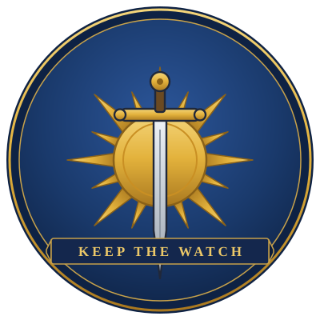

# The Hellriders & The Wall — Lore Sheet

*One-stop reference for the Hellrider order, "the Wall," Hellrider blue, and the Bhaal-cult thread that runs under Drenwal's whole arc. Tags: **[CANON]** = sourcebook · **[HOMEBREW]** = our campaign.*

> *A sun pierced by a sword.* The sigil of the Hellriders of Elturel.

---

## The order — Hellriders of Elturel [CANON]

The elite knight-order of **Elturel**, the city in Elturgard lit by the **Companion** (a second sun hung in the sky). The Hellriders are mounted holy warriors — disciplined, devout, sworn to hold the line against the dark.

They earned their name doing the thing the name says: **they rode into Hell.**

---

## "The Wall" = the Descent [CANON event, table name]

**"The Wall" is what this table calls the great Hellrider charge into Avernus** — also spoken of as **"the Descent."** Our notes use the two interchangeably: the spectral knight who *"died at the Wall, in the Descent"*; Lucan who has hung in the brambles *"since the Wall."*

**What happened:** generations ago, a demonic host threatened to break out of Avernus into the Material Plane. **Zariel** — then a celestial, not yet a devil — led a host of mortal Hellriders through a portal to take the Blood War to the enemy directly. It ended in catastrophe: the army was broken, and **Zariel fell**, becoming the archdevil who rules Avernus today.

So "the Wall" carries weight at the table — it's the order's founding glory **and** its great wound. To have been "at the Wall" is to be a relic of a lost age.

> **When a player hears "the Wall,"** they should feel: *old, holy, doomed.* The charge nobody came back from.

---

## Hellrider blue [HOMEBREW signal]

The **livery color of the order** — the deep blue of their armor, tabards, and robes, blazoned with the sigil. It is a deliberate **visual flag** in our prep: when a character wears Hellrider blue, they (or their blood) belonged to the order.

Seen so far:
- **Ser Lucan** — armor *"Hellrider blue, blackened with age."*
- **Dumal** — robe *"Hellrider blue, deep-cut and old,"* lining bears the sigil, *"Pre-Descent."*
- **Halvard** (Drenwal & Dumal's father) — a Hellrider; his legacy is the thread tying all of the above together.

Faded, blackened, deep-cut: the blue is almost always **old** when the party sees it. These are the colors of the dead and the left-behind.

---

## The sigil — a sun pierced by a sword

- **Blazon:** a golden **sun** (the Companion of Elturel) **pierced by a sword**, on a field of Hellrider blue.
- **Image:** `Images/hellrider-sigil.svg` (scales cleanly; good for a handout, a wax seal, or a printed prop).
- **Where it shows up:** stamped on armor and tabard linings, struck into the **Hellrider sigil-pendants** carried by the knights.

### Mechanics tied to the sigil [HOMEBREW]
- **Sigil-trick (taught by Lucan):** grants **+1 to the next saving throw vs. Bhaal-aligned effects** (lasts 24h). Directly useful against Dumal.
- **Hellrider Sigil pendants (loot ×2):** silver pendants off dead Hellriders — **+1 to one save vs. fiend effects, 1/long rest.** Worth nothing in coin; everything in meaning.
- **Lucan's sigil is the third pendant** — and if he was rescued or mercy-killed, **Drenwal recognizes it.**

---

## The hidden thread — the Bhaal cult inside the order [HOMEBREW]

This is the secret the lore sheet exists to keep straight. The clean story — "Halvard died at the Wall" — is a **lie.**

Per **Dumal's reveal** (Session 5):
- The Hellrider order **had a Bhaal-sworn cult buried inside it for generations** — *"Hellriders by day, knife-priests by night."*
- They **knew what Halvard's family was** (a Bhaalspawn bloodline through the **Mother**), and watched them from the cradle.
- **Halvard was not killed at the Wall.** A cultist **slit his throat in his sleep the night before the Descent**, with the **bone-handled ritual shortsword Dumal now carries.**
- **The Mother** tried to *"starve the line out"* by dying early — hoping Bhaal would forget her children. She was wrong, but she was brave.
- **A third sibling exists — Senna** [→ see the Session 6 Dial]. The Mother died before she was born; Halvard protected her name to his last breath.
- **Mordenkainen has known all of this for ~60 years** and said nothing. *Open hook — "Ask him why."*

So the sigil and the blue are not just heraldry — they're the **mask the cult wore.** The order that should have protected Drenwal's family is the order that murdered his father.

---

## Who carries it now

| Person | Tie to the order | Status |
|---|---|---|
| **Halvard** | Hellrider; Drenwal & Dumal's father | Murdered by the cult; "died at the Wall" (the cover story) |
| **Ser Lucan of the Crimson Watch** | Hellrider, survived the Descent | Trapped in Red Ruth's brambles ~30 yrs → see Bone Brambles |
| **Dumal** | Bhaalspawn son; wears the blue, carries the murder-blade | The ambusher → Session 6 |
| **Drenwal** | Bhaalspawn son; the heir who *doesn't* yet wear the blue | PC — the whole thread bends toward him |
| **Senna** | The hidden third sibling | Unseen; future arc |

---

## DM quick cues

- **Drop the blue as a tell.** Any time you want to telegraph "this connects to Drenwal's family," put someone in faded Hellrider blue.
- **"The Wall" is sacred-sad, not triumphant.** Survivors are haunted, not proud.
- **The sigil is a mercy object.** It keeps showing up around mercy choices (Lucan begging for death, the sigil-trick against Bhaal). Mercy is the order's true creed — *"Keep the watch."*
- **Halvard's last words** (via Lucan): *"Find him. Find Dumal. Save him."* — the order to which the Session 6 ambush is Bhaal's cruel answer.

## Open threads
- Why did **Mordenkainen** stay silent for 60 years?
- Where is **Senna**?
- Does the **Bhaal cult** still operate inside what remains of the Hellriders?
- What happens when **Drenwal** finally puts on the blue?
