# Session 5 Primer — The Flame Ascendant

**Date:** TBD
**Party:** 3 PCs Level 11 — Drenwal (Light Cleric, Bhaalspawn), Aurora (Archfey Warlock, now Moonkite-bonded), Asimov (Soulknife Rogue, Soul Capacitor)
**Target length:** 5 hours
**Tone:** Lore-saturated family confrontation. Two scenes of dialogue per scene of combat. The session ends with a knife in Drenwal's worldview — not in his back.

---

## MIDJOURNEY VISUAL ASSETS (generated 2026-05-16)

All 14 scenes generated and downloaded via Midjourney v7 (`--style raw --s 250`). **All 56 variants (4 per scene) are committed to the repo** under `Images/session-5/`. The primer below uses the `-a` variant (top-left of each grid) as the default embed. To swap to a different variant for any scene, change `-a` to `-b`, `-c`, or `-d` in that `` line.

| # | Scene | MJ Job URL | Default embed | Embeds at |
|---|---|---|---|---|
| 1 | Throne Room Aftermath | https://www.midjourney.com/jobs/32669e47-5820-4c22-a45a-7f07f8ddf577 | `scene-01-throne-room-a.webp` | COLD OPEN |
| 2 | Moonkite portrait | https://www.midjourney.com/jobs/92e3e8f7-499d-49ab-975c-788d5c8da9a5 | `scene-02-moonkite-a.webp` | Beat 1.2 (Moonkite Stands) |
| 3 | Bhaal carving "He misses you" | https://www.midjourney.com/jobs/f35603cb-5de8-4c81-b28b-fcdc87ff80b8 | `scene-03-carving-a.webp` | Beat 1.3 (The Carving) |
| 4 | Vix the Imp | https://www.midjourney.com/jobs/ed963509-23f9-441b-9eb0-1cbfbe754ac6 | `scene-04-vix-a.webp` | Beat 2.3 (The Herald) |
| 5 | Dumal emerges from smog | https://www.midjourney.com/jobs/531547a8-7035-4906-85dd-3550a2b272a6 | `scene-05-dumal-arrives-a.webp` | Beat 3.1 (The Approach) |
| 6 | Dumal portrait close-up | https://www.midjourney.com/jobs/cbe44e11-3aa9-4443-8bde-b38220ca4cc4 | `scene-06-dumal-portrait-a.webp` | DUMAL STATBLOCK |
| 7 | The Letter handout | https://www.midjourney.com/jobs/2599dba9-f6f1-4ead-9bdb-d5db96ecff35 | `scene-07-letter-a.webp` | Beat 1.1 (THE LETTER) |
| 8 | Dumal's hand-drawn map | https://www.midjourney.com/jobs/7a3c4ec6-28a8-4a20-884d-011174bc8776 | `scene-08-map-a.webp` | Beat 5.2 (What He Left Behind) |
| 9 | Bone-handled shortsword | https://www.midjourney.com/jobs/5d5b7ad2-7d16-48be-9d27-e3a89a9cce67 | `scene-09-bone-dagger-a.webp` | Beat 5.2 alongside map |
| 10 | Senna (foreshadow — do NOT show this session) | https://www.midjourney.com/jobs/91748390-3630-487b-994d-80600c0b5dd3 | `scene-10-senna-a.webp` | DM ONLY APPENDIX (bottom) |
| 11 | Aldwin Ardentwine's body | https://www.midjourney.com/jobs/137fe620-0bca-421c-bab4-6f9adaeff265 | `scene-11-aldwin-body-a.webp` | Beat 1.1 (The Body) |
| 12 | Bhaal Cultist token | https://www.midjourney.com/jobs/8ca9eaa5-74fa-4128-8862-e81322dc85a7 | `scene-12-cultist-a.webp` | Supporting Cast → Cultists |
| 13 | Bone Devil token | https://www.midjourney.com/jobs/b8467ccd-2dcf-40e1-b186-ebd9a14fa75f | `scene-13-bone-devil-a.webp` | Supporting Cast → Bone Devil |
| 14 | The Star (final beat) | https://www.midjourney.com/jobs/f7556314-4c01-4386-b7e1-a542149ca4c8 | `scene-14-star-a.webp` | Beat 5.4 (Final Beat) |

**Note on quality:** images are 640px webp (the MJ web-preview resolution). For high-res print (handouts, projector at >1080p) open the MJ job URL on any device, click → "Download" → pick the upscaled 4K version. Drop those into `Images/session-5/` with the same filename to replace.

Full prompts and style direction in `session-5-artstyles.md`.

---

## OPEN5E CANONICAL REFERENCES (SRD 2024 — verified 2026-05-16 via mcp__open5e)

All non-homebrew statblocks and spell mechanics in this primer reference the SRD 2024 dataset. Live queries during the session via `mcp__open5e__get` / `search` / `rag_search`.

### Creature statblocks used this session

| Creature | AC | HP | CR | Speed | Open5e URL |
|---|---|---|---|---|---|
| Bone Devil (Dumal's bodyguard) | 19 | 142 | 9 | 40 ft, fly 40 ft | https://open5e.com/monsters/bone-devil |
| Cult Fanatic ×3 (Bhaal cultists) | 13 | **22** | 2 | 30 ft | https://open5e.com/monsters/cult-fanatic |
| Imp (Vix the herald) | 13 | 10 | 1 | 20 ft, fly 40 ft | https://open5e.com/monsters/imp |
| Deva (encounter table #19) | 17 | 136 | 10 | 30 ft, fly 90 ft | https://open5e.com/monsters/deva |
| Night Hag (encounter table #16) | 17 | 112 | 5 | 30 ft | https://open5e.com/monsters/night-hag |
| Erinyes (encounter table #6) | 18 | 153 | 12 | 30 ft, fly 60 ft | https://open5e.com/monsters/erinyes |
| Chain Devil (encounter table #6) | 16 | 85 | 11 | 30 ft | https://open5e.com/monsters/chain-devil |
| Bearded Devil (encounter table #17) | 13 | 52 | 3 | 30 ft | https://open5e.com/monsters/bearded-devil |
| Barbed Devil (encounter table #17) | 15 | 110 | 5 | 30 ft | https://open5e.com/monsters/barbed-devil |
| Lemure (encounter table #3) | 7 | 13 | 0 | 15 ft | https://open5e.com/monsters/lemure |
| Pit Fiend (encounter table #8 — distant) | 19 | 300 | 20 | 30 ft, fly 60 ft | https://open5e.com/monsters/pit-fiend |

### Spells with RAW relevance this session

| Spell | Level | Save | Key RAW Note | Open5e URL |
|---|---|---|---|---|
| **Wish** | 9 | — | STR 3 for **2d4 days** (RAW), 1d10 necrotic per spell level until long rest, **33% chance never to cast again**. See Aurora cost section for our homebrew variant. | https://open5e.com/spells/wish |
| **Banishment** | 4 | CHA (DC by caster) | Fiend transported to home plane if spell lasts 1 minute. Concentration. **Primary mechanism to clear Smiler debt.** | https://open5e.com/spells/srd-2024_banishment |
| **Plane Shift** | 7 | CHA (unwilling) | 250+ gp forked rod attuned to target plane. Touch. 8 willing or 1 unwilling. **Alternative Smiler banishment.** | https://open5e.com/spells/srd-2024_plane-shift |
| **Hold Person** | 2 | WIS | Paralyzed, 1-min concentration. Cult Fanatic cast — DC 11. | https://open5e.com/spells/srd-2024_hold-person |
| **Inflict Wounds** | 1 | CON (DC 11 from Fanatic) | Touch, 2d10 necrotic on fail. | https://open5e.com/spells/srd-2024_inflict-wounds |
| **Spiritual Weapon** | 2 | — | Bonus action, 1d8+mod force, 60 ft. Cult Fanatic uses. | https://open5e.com/spells/srd-2024_spiritual-weapon |
| **Sanctuary** | 1 | WIS | Attackers retarget. Deva-feather one-shot option. | https://open5e.com/spells/srd-2024_sanctuary |
| **Remove Curse** | 3 | — | Ends curses. **Required to remove Bhaal-mark carved by Dumal's Ritual Dagger.** | https://open5e.com/spells/srd-2024_remove-curse |

### Live-query commands at table

```
mcp__open5e__get          { resource_type: "monsters", slug: "bone-devil" }
mcp__open5e__search       { query: "<term>", resource_type: "spells"|"monsters" }
mcp__open5e__rag_search   { query: "wish spell exact text", mode: "hybrid" }
mcp__open5e__list         { resource_type: "monsters", cr: 12, type: "Fiend" }
```

Spell slug format: `srd-2024_<spell-name>` (e.g. `srd-2024_banishment`). Monster slugs are plain (e.g. `bone-devil`).

---

## DESIGN THESIS

> Bitter Breath was a problem with a body. Dumal is a problem with a *face*.

This session is structured around **one extended dialogue scene** with the brother who became what Drenwal is trying not to become. Combat is the punctuation, not the sentence.

Three things make it land:

1. **Dumal does not want Drenwal dead.** He wants Drenwal home. The threat of violence is real, but it is *strategic* violence — a tool to bend Drenwal, not break him. The party can survive without a single sword swing if they play it right.
2. **Dumal knows things.** Their mother's death. Their father's death. A third sibling. The Hellrider order's secret. The lie inside Mordenkainen's cure. Hand these out as leverage, not exposition.
3. **Aurora is now a *problem*.** Word of the Wish at the Palace has already reached Hell. Dumal addresses her directly. Asimov, too. Nobody is just background tonight.

**Win state:** Drenwal walks away changed. Aurora walks away marked. Asimov walks away owed a debt. Bhaal/Gargauth meters update visibly. **The party did not lose anyone — but they will not be the same party next session.**

---

## STARTING STATE (SESSION 4 RECAP)

### What happened at the Palace of Gore

- **Bitter Breath defeated** — not killed, **reverted**. Aurora used a **Ring of Wishes (1 charge, now SPENT)** and willed his power to return *whence it came*. He devolved back into the mortal man he was before he became a devil. The accumulated decades of devilhood caught up at once. **He died of old age on the throne room floor.** His body remains in the Palace. **The ring is now a mundane band of silver — useless.**
- **The Moonkite is fully free** — same Wish, cascading effect. The Moonkite is now bonded to Aurora as her mount.
- **Moonbow of Celestial Warding** — the fusion happened. Aurora's +2 longbow + her Wand of Celestial Warding became a single weapon (see Loot section).
- **Haruman of the Crimson Legion was killed by the party** earlier (any prior session). A trophy is owed — DM, pick something the party already has that we'll retcon as "Haruman's piece" (his horn, his blood-vial, a scrap of his banner).
- **Smiler the Defiler — deal made.** Party agreed to **banish him to his realm** in exchange for his help at the Palace. **This debt is unpaid.** Smiler is alive, holding them to it.
- **Captain Grozz — killed in the boss fight.** The hobgoblin captain didn't survive.
- **No loot from Bitter Breath.** His power, weapons, soul coins, and Bhaal-marked Gutripper all dissolved with him when the Wish reverted his existence. The party has nothing of his.

### Aurora's Wish stress (HOMEBREW — deviates from RAW; locked in at Session 4)

Aurora paid the cost. Use these mechanics for **3 in-game days**:

- **STR reduced to 3.** All STR checks, STR saves, athletics: -4. Carry capacity: ~30 lbs (effectively armor-and-bow only).
- **Cannot cast spells of 1st level or higher for d4 = 2 days** (rolled at table; this is a guideline — adjust if pacing breaks)
- **Wish is GONE.** The ring had only 1 charge. It is now an inert silver band. Aurora cannot cast Wish again unless she finds another item or learns it natively (Mystic Arcanum at higher level).
- **Side effect:** When she casts ANY divination or summoning spell while in this state, the Moonkite *appears* — even if it's not summoned. The celestial sees through her now.

> **RAW comparison (SRD 2024 Wish — https://open5e.com/spells/wish):** Strength becomes 3 for **2d4 days** (not 3); each spell cast until next long rest costs **1d10 necrotic per spell level**; **33% chance she can never cast Wish again** (irrelevant here — ring is one-charge anyway). Our homebrew is gentler on damage but harsher on spell access. **If Aurora's player asks for RAW, switch to RAW for the spell-cost mechanic (it makes her playable sooner) and roll the d4 days as 2d4 instead.** Either choice is defensible — pick one and don't switch mid-session.

### The Bhaal carving at the Palace exit

When the party leaves the Palace, the carved Bhaal symbol at the exit is **fresh**. The blood is still tacky. Dumal was here. He watched. He left this for them deliberately — a calling card.

---

## BHAAL / GARGAUTH INFLUENCE — SYSTEM v2 (NEW)

**Replace the old 0-6 tick system. Two parallel meters 0-100. Visible to player.**

### Meters at session start

- **Bhaal's Claim:** 50 (carried over — base 30 + 5 each for: Bloodbath kill blow, Bhaal hijack of Divine Intervention, Mordenkainen revealing Bhaal-blood truth, Dumal's carving at Palace exit. Adjust if you scored differently.)
- **Gargauth's Bargain:** 35 (carried over — base 20 + Shield use sessions + the "I could catch you when you fall" offer.)

If you want different baselines, set them now and explain to the player.

### Bhaal's Claim ↑

| Action | Tick |
|---|---|
| Cruel kill on humanoid (called shot, finisher on surrendered, ritual murder) | **+5** |
| Critical-hit kill | **+2** |
| 3+ days without a kill (Hunger) | **+3/day**, DC 15 WIS to cap at +5 |
| Accept Bhaal-aligned power (hijacked Divine Intervention, Bhaal-marked weapon, dream "advice") | **+10** |
| Witness Bhaal symbol / receive Bhaal dream / hear Dumal's voice | **+1 to +5** (DM call by intensity) |
| Dumal makes physical contact with Drenwal | **+8** |
| Drenwal kills someone Dumal pointed at | **+15** |

### Gargauth's Bargain ↑

| Action | Tick |
|---|---|
| Use Shield offensively | **+3 per session** |
| Accept Gargauth's whispered advice in-narration | **+5** |
| Make ANY bargain or contract (party-wide trigger, but Drenwal-witnessed) | **+5** |
| Ask Gargauth a direct question | **+2** |
| Cast Light-domain spell flavored with Shield-imagery | **+1** |
| Accept Gargauth's offer to "catch the soul" | **+25** (one-time, massive) |

### Both ↓ (these matter)

| Action | Tick |
|---|---|
| Devotional act to a third deity (prayer at a shrine, public service in a god's name, channeling Light overtly *and naming the source*) | **−5 from highest** |
| Refuse offered power with overt narration | **−3 from offerer** |
| Spare or heal an enemy Drenwal could have killed | **−2 Bhaal** |
| Personal cost paid for a virtuous outcome | **−3 from highest** |
| Speak truth about his Bhaal blood to a non-party NPC | **−5 from Bhaal** (vulnerability weakens claim) |
| Lulu interceding (she's a hollyphant — celestial influence) | **−2 from highest** per session, max 1× per session |

### Thresholds (what happens at what number)

| Meter | Effect |
|---|---|
| **25** | Flavor only — dreams, whispers, dual-vision moments |
| **50** | **Mechanical penalty.** Bhaal 50: disadvantage on Insight when target is helpless. Gargauth 50: WIS save DC 12 when entering any contract or you must sign. |
| **75** | **Involuntary acts.** Bhaal 75: a Bhaal symbol carves itself into the next humanoid Drenwal kills (free action, no save). Gargauth 75: the Shield activates without command in response to perceived threat. |
| **100** | **Claimed.** The owning deity has narrative control during the rebirth. (Catastrophe state — only resolved by drastic player action.) |

### The Cure Pressure (the actual question)

When Drenwal dies and is reborn:
- The **highest** meter wins the soul by default.
- A **third deity** can intervene IF Drenwal has at least **30 devotional points** with them — accumulated by overt, deliberate worship/service. This is hard to do without being noticed by Bhaal/Gargauth.
- **Lulu's god (Lulu's former mistress's celestial patron)** is a free starting candidate at 5 devotional points (Lulu vouches for him by existing).
- **The Moonkite's patron god** is another candidate — Aurora's archfey patron is *not* a god, but the Moonkite was kept by a god-tier celestial. Investigating this is a Session 6+ thread.

**Track devotional points to candidate deities visibly.** Three columns on your DM screen: Bhaal / Gargauth / [Other].

### Why this is better than the old system

- Specific actions tick specific amounts (no DM guessing)
- Player can SEE the meters, so they can play toward outcomes
- Reductions are possible (the old system only went up)
- Multiple deities competing creates a real strategic choice
- The "third option" requires sustained narrative work, not a single moment

---

## PACING (5 hours)

| Block | Time | Content |
|---|---|---|
| **Cold open + Palace aftermath** | 30 min | Body of the mortal man, Moonkite bonding, Aurora's STR 3 reveal, Bhaal carving at exit |
| **Act 1: The Departure** | 45 min | Choices about the body, Smiler debt, direction to head, the smog thinning |
| **Act 2: The Approach** | 45 min | Travel, whisper-fog, herald arrives (an imp under a parley sigil), Lulu reacts to celestial scent in the air |
| **Act 3: Dumal Arrives — The First Cut** | 1h 15min | Standoff, opening dialogue, the family reveal, the offer |
| **Act 4: The Second Cut — Choice or Combat** | 1h | Either negotiation deepens into revelations, or it tips into a tactical fight |
| **Act 5: The Cliffhanger** | 15 min | Dumal departs (alive). What he leaves behind. Fallen Three teaser. |

---

## COLD OPEN

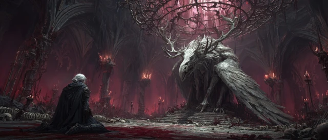

Read aloud:

> The throne room of the Palace of Gore is suddenly very quiet.
>
> Above you, the iron cage that held the Moonkite hangs open — its bars peeled back like the petals of a flower. The Moonkite itself is on the floor, head down, ribs heaving. Silver light leaks from cracks in its skin and pools beneath it, slow as honey. Its wing twitches, then folds. It is *alive*.
>
> Five feet from it, on the floor: an old man. Eighty, maybe ninety years old. White hair like wet straw. Skin like rice paper. He is naked under the velvet robe someone — *something* — once draped on his devil-self, and the robe is now too big for the shrunken body inside it. His eyes are open and unblinking and *brown*. Not yellow. Brown.
>
> He is not breathing.
>
> The veins on Aurora's hand — the hand still wearing the Ring of Three Wishes — are silver. Not bruised silver. *Lit* silver. Like the Moonkite is leaking out of her fingers too.
>
> Drenwal — your Shield is *humming*. Not whispering. Humming. The kind of hum a thing makes when it's seen something *interesting*.
>
> Outside, somewhere up the gore-blood tunnels — *bone, settling*. The Palace shifting around the death of its master. Or something walking.

**Tracker updates at scene start (announce to player):**
- Bhaal's Claim: **50** (carving at exit pre-loads this)
- Gargauth's Bargain: **35**
- Aurora STR: **3** (for next 3 in-game days)
- Aurora spells: **none above cantrip** for next d4 days (roll: 2)
- Ring of Wishes: **SPENT — inert silver band, no charges**

---

## ACT 1 — THE DEPARTURE (45 min)

### Beat 1.1 — The Body

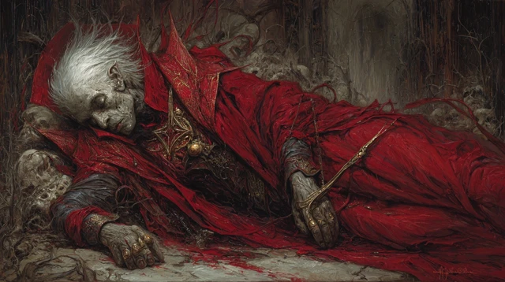

The mortal man's body is on the floor. Players will react. Let them lead.

**What investigation reveals (no DC — let them have it):**

- The robe he wears is **Hellrider blue, deep-cut and old**. The lining bears a faded sigil — a sun pierced by a sword. **A Hellrider sigil. Pre-Descent.**
- A signet ring on his shriveled finger — heavy gold, the sigil of a noble house Aurora or Drenwal might recognize on a DC 14 History check. (DM: pick a noble house from your Elturel canon. Default: **House Ardentwine**, minor nobility, all members presumed dead in the Descent.)
- His left forearm bears an old scar in the shape of an **inverted nine-pointed star** — the mark of someone who renounced a vow to a celestial. **He was a paladin once. He fell. THEN he became a devil. Aurora's wish stripped both.**
- His mouth has been moving in death. There's blood on his tongue from where he's been biting it. **He tried to say something before the wish caught up. He almost made it.**

**Drenwal Insight DC 13:** *This man's path was your path. Hellrider. Fell. Became a thing. He died old of regret, not of devilhood. If your cure works the way Mordenkainen described — this is the shape of you, on the other side. Aged. Spent. Free.*

**Player decision: what do they do with the body?**

| Choice | Consequence |
|---|---|
| Leave it | Dumal will desecrate it. Tracker: **+3 Bhaal** if Drenwal allowed it. |
| Burn it | Clean closure. Tracker: **−2 from highest**. Aurora can use a Moonbow shot to ignite it — symbolic. |
| Carry it out for proper burial | Heavy. Aurora can't (STR 3). Asimov or Drenwal can. Tracker: **−4 from highest** if completed. Plot seed: returning the body to House Ardentwine's tomb in Elturel becomes a future hook. |
| Search the room one more time | DC 14 Investigation: a **small folded letter** in the robe's hem. Sealed with wax. Unsigned. Reads in shaky hand: *"If you read this and you are the one who freed me — I am sorry. He took my brother first. He will take yours too. Run. — A."* See "The Letter" below. |

### THE LETTER (handout text)

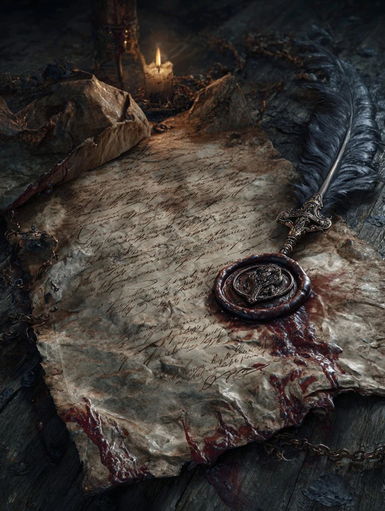

Hand this to the player physically if possible:

> *To whoever reads this:*
>
> *I do not know how long I have been here. I do not know if I am still myself when I write this. I have moments. I have hours, sometimes. When the thing inside me sleeps.*
>
> *If you are reading this, you have freed me, or killed me, or you are looking through the pockets of my corpse. Either way — thank you.*
>
> *I was Aldwin Ardentwine. I was a Hellrider. I am — I was — a paladin of the Morninglord. Then I was nothing. Then I was Bitter Breath. And now, gods willing, I am only a body again.*
>
> *I write this because I have heard them speak. The Flame Ascendant comes here often. He brings news. He sits with my devil-self at the throne and they share goblets like brothers. He is a Bhaalspawn. He has another. He hunts him slowly because hunting is the point.*
>
> *He took my brother first. He will take yours too.*
>
> *Run. Or kill him in his sleep. Or do not, and join him, and I will be sorry I ever wrote this.*
>
> *— A.*

**This is the primary lore artifact of the session.** It pre-loads Dumal as a known threat AND establishes that the family pattern (Hellrider brothers, one falls, the other is hunted) is not just Drenwal's — it's a *Bhaal MO*.

### Beat 1.2 — The Moonkite Stands

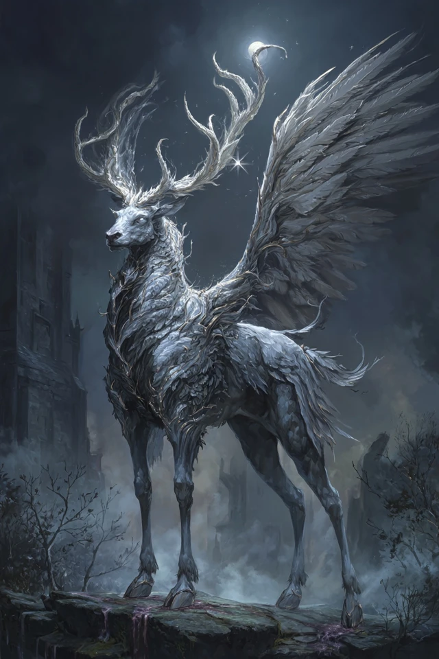

The Moonkite raises its head. It is the size of a small horse, antlered, with feathered wings and feline grace. Its eyes meet Aurora's. There is **no speech** — the bond is older than language.

**Aurora gains:**
- **The Moonkite as mount.** Statblock: see "Companions" section.
- A passive sense of when celestial magic is being cast within 1 mile.
- A weight in her chest she'll come to understand as *responsibility*. Not a debuff. A presence.

**Aurora's choice (RP only, no mechanic):** What does she name it? The name matters — it's the first time she's named a thing that wasn't hers to name.

### Beat 1.3 — The Carving

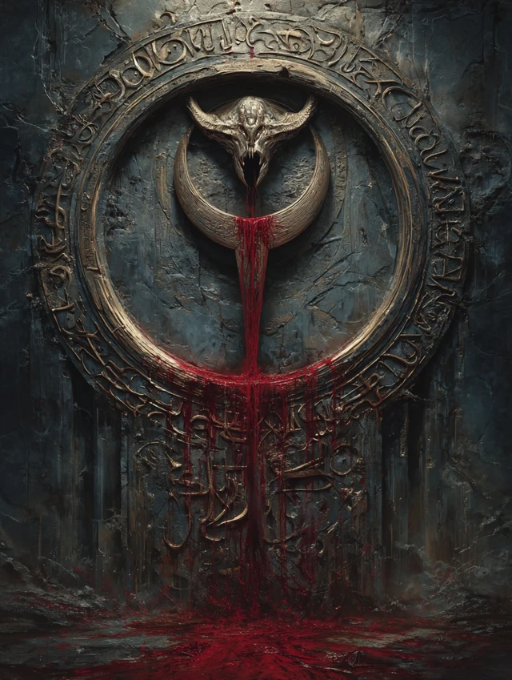

When the party exits the throne room and reaches the upper Palace gate, they see it:

> The carving is on the inside of the gate — facing the throne room they just left. Not facing out. **It was carved for the master of the Palace. It was carved for Bitter Breath, by someone who walked past the cage every time he visited.**
>
> The Bhaal symbol. A circle of blood, with a downward dagger inside it. The blood is *still wet*. Wet for hours, maybe a day.
>
> Below the symbol, in a different blood — finer, careful, calligraphic — three words:
>
> ***"He misses you."***

**Drenwal — passive (no roll):** That's Dumal's handwriting. You remember it from letters. From childhood. From the wall above your shared bed when he was nine.

**Tracker:** Bhaal's Claim **+5** (already pre-loaded; if you didn't pre-load, apply now).

### Beat 1.4 — Direction

The Lady Vengeance is **still wedged behind the rubble collapse** from Session 4. They walk out, or they don't walk out.

Outside the Palace, the gore-smog has thinned but not vanished. The river of blood is sluggish — losing energy now that its master is gone. Birds (or things that resemble birds) circle high above. Nothing is attacking. Everything is *watching*.

**Choices for the party:**

| Route | Outcome |
|---|---|
| **South — towards Olanthius's wandering ground** | They will be intercepted by Dumal en route. Default path. |
| **Northeast — back to the Lady Vengeance crew, then re-route** | Dumal intercepts at the wreckage instead. Same encounter, different terrain. |
| **East — towards Bel's Forge** | Dumal intercepts at a road shrine. Same encounter, different terrain. |
| **Set camp here, recover** | Dumal walks INTO the Palace to find them. Worst tactical option for the party. |

**In all cases, Dumal arrives in Act 3.** The terrain decoration is the only thing that changes.

---

## ACT 2 — THE APPROACH (45 min)

### Beat 2.1 — Aurora's Mount Test

About 30 minutes out, Aurora attempts to mount the Moonkite. The first attempt:

**Aurora rolls STR (Athletics) at -4 (STR 3).** DC 5 to mount.

- **Success:** She gets on. The Moonkite kneels for her. Beautiful moment.
- **Failure:** She slides off. The Moonkite waits patiently. Asimov has to boost her up. This becomes a recurring beat. *She is the Wish-wielder, and she cannot get on her own mount.* Lean into the irony.

### Beat 2.2 — Lulu's First Sniff

Lulu — riding on someone's shoulder or trotting alongside — stops. Looks south. Her trunk lifts.

> *"That. That smell."* (Lulu's voice is warm, child-soft, slightly slurred from millennia of damage.)
>
> *"That's not... that's not a devil. That's something else. That's a *brother*. A brother who chose. A brother who was loved and chose anyway."*
>
> She looks at Drenwal. She is suddenly, completely lucid for the first time in weeks.
>
> *"I am so sorry, little flame. I am so sorry."*

**Bhaal influence (Lulu effect):** −2 from highest meter (one-time, per session).

### Beat 2.3 — The Herald

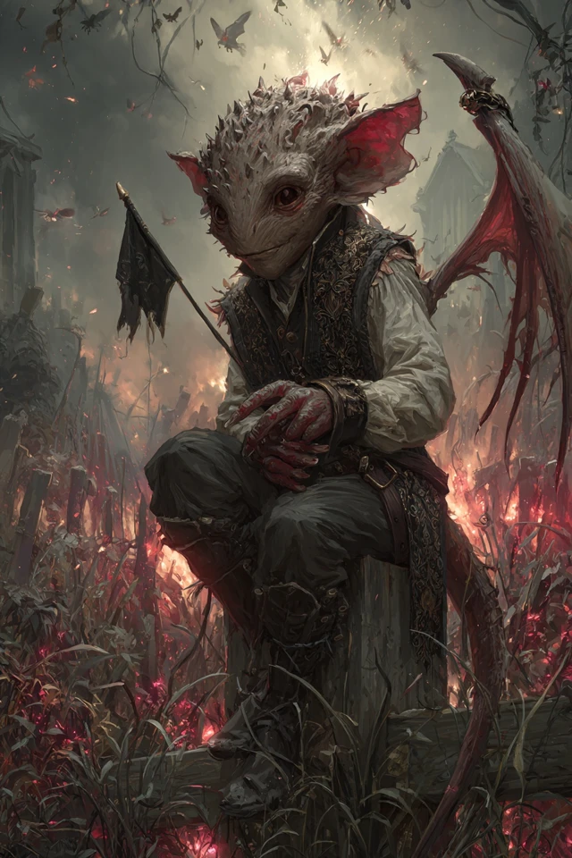

Two hours in: a single **imp** descends from the smog and lands on a charred fence-post twenty feet ahead of the party. It is holding a small black flag. The flag is plain — no sigil, no marking. **A parley flag.**

> The imp clears its throat. Its voice is too polite.
>
> *"With the deepest respect of His Ascendancy, Dumal of Elturel, called the Flame, this herald requests parley with the company of Drenwal of Elturel and his honoured companions. His Ascendancy will arrive within the hour. He requests that no spells be cast at him during the approach. He asks for nothing else."*
>
> The imp pauses. Then, brightly:
>
> *"He also asks that the lady with the Wish ring not make any more of those, please. He'd consider it a personal kindness."*
>
> *It bows. Then it stays there, on the post, waiting for a reply. It does not leave until one is given.*

**The imp's name is Vix.** If asked. He's been Dumal's herald for six years. He likes biscuits.

**Player responses:**

- **Accept parley:** The imp bows, vanishes. Dumal arrives in 45 minutes.
- **Refuse parley:** The imp shrugs, says *"He'll come anyway, but he'll be cross,"* and vanishes. Dumal arrives in 20 minutes, hostile from the start (-1 to all his peace-options).
- **Kill the imp:** Dumal arrives in 10 minutes, *furious*. He breaks parley before it begins. Initiative is rolled the moment he's in sight. **This is the worst path.**

### Beat 2.4 — Drenwal's Hunger Check

It has been **5 in-game days** since Drenwal's last kill (Bloodbath, two sessions ago, didn't count — Asimov's Rasheem consumed him).

**DC 15 WIS save:**
- **Success:** Hunger held in check. Tracker: Bhaal +3 (5 days × +3, capped at +5 means he's getting +5; success caps it at +3 instead).
- **Failure:** Tracker: Bhaal **+8** (full hit). Dreams that night are worse. He wakes seeing red.

**Drenwal can voluntarily kill something to relieve Hunger.** Anything large enough — a stray devil minion, even a sacrificed beast. But every voluntary kill is **+5 Bhaal**.

The trap: feeding Hunger is *fast* but ticks the meter. Resisting is *hard* but might reach a threshold via dream-witness instead.

---

## ACT 3 — DUMAL ARRIVES — THE FIRST CUT (1 hour 15 min)

### Beat 3.1 — The Approach

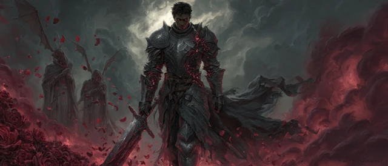

Dumal does not come down a road. He walks *out of the smog itself* — like the smog parts for him. Behind him, four shadowy shapes follow at a respectful distance: three **Bhaal cultists** (use Cult Fanatic stats, MM p.345) and one **Bone Devil** bodyguard.

> He is tall — taller than Drenwal remembered. Hellrider plate, but corrupted — the steel has *veins* of red-glowing rune-work, like cooling magma. The lance on his back is a **Bhaal-marked weapon** — its blade is grey-black, perpetually wet-looking. At his hip: a small **bone-handled shortsword** — the ritual blade.
>
> His face is the worst part. It is Drenwal's face. Older — five years older — leaner, scarred along the jaw, but unmistakably *the same blood*. Same eyes. Same set of the mouth. He smiles, and it is Drenwal's smile from when Drenwal was a child.
>
> He stops thirty feet out. He holds up both hands, palms open. Empty.
>
> *"Little brother. You look terrible. Have they been feeding you?"*

### Beat 3.2 — Sample Dialogue (use what fits, improvise the rest)

**Opening (after Drenwal speaks first, whatever he says):**

> "I know. I know. We have *much* to say to each other and I am keeping you. Let me offer some preliminaries.
>
> One — I am not here to fight you. Not today. I am keeping my hands where you can see them. If you attack me, I will defend myself, but I will not begin.
>
> Two — your companions are welcome to listen. I will not speak around them. The Wish-wielder, especially. She and I will have words. Yes, lady, *you*. Hello."
>
> *He nods at Aurora. Direct. Polite. Not threatening.*
>
> *"And the rogue with the lamp. Hello, friend. We have not met. Your master is going to eat you eventually — you know that, yes? He won't be subtle. Lamps are *patient.* I would offer counsel, but you have not asked, so I will not."*
>
> *He looks back at Drenwal.*
>
> *"Three — I have spent six years preparing to see you again. The first half of those years I spent learning to *speak*. I want you to know I am choosing every word. So listen carefully."*

**The Childhood Name:**

> "Den. May I call you that? I always did. Mother used to scold me — she said it was a *foolish* name for a *Hellrider's* son. She was wrong about a great many things, but she had pretty hands. Do you remember her hands? I do."

*(This is the moment Drenwal realizes Dumal knows everything Drenwal half-remembers and more. The audience should feel the air leave the room.)*

**The First Reveal — Mother:**

> "She did not die of the wasting sickness. I want you to know that. I learned this later — much later. I would not have believed it if Bhaal himself had not whispered it to me, and even then I held it for years before I accepted it.
>
> She was *one of us*, Den. A Bhaalspawn. Like me. Like you. She knew it. She had known her whole life. And when she had us — when she saw what we were going to be — she made a choice. She poisoned herself. *Slowly.* Years. So that we would think it was illness.
>
> She thought she could *starve the line out of us by dying early*. She thought if she did not feed Bhaal's claim by living for him, he would *forget us*.
>
> *(He laughs, very softly.)*
>
> "She was wrong. But she was *brave*. I want you to know she was brave."

**The Second Reveal — Father:**

> "Father did not die at the Wall, either. The Hellrider order knew what we were. They had known about Mother. They watched her for forty years and they watched us from the cradle. There was a *cult* inside the order, Den. Bhaal-sworn. They had been there for generations. *Hellriders by day, knife-priests by night.*
>
> One of them killed Father in his sleep, the night before the Descent. Slit his throat with a ritual blade. *(He touches the bone-handled shortsword at his hip.)* This one, actually. It was passed to me. I was — *flattered*. Now I know better.
>
> Mordenkainen knows all of this. He has known for sixty years. *Ask him.* Ask him why he did not tell you when he had you in his tower."

**The Third Reveal — The Sister:**

> "There is one more of us. Did you know? Of course you did not know. Mother died before she was born. Father never spoke her name — to his last breath, he was protecting her.
>
> She is *alive*. She is *young*. She is being raised in a place where Bhaal cannot find her yet — but Bhaal is patient and the place is not perfect. *I* know where she is. I have not gone for her. I am waiting.
>
> *(A pause. He watches Drenwal's face.)*
>
> "If you come home, brother, you and I will go to her *together*. We will protect her. Not Bhaal — *we*. The two of us, between her and the world, the way it was *supposed* to be.
>
> If you do not come home... I will go for her *alone*. And what becomes of her then — well. That is on your conscience."

**Aurora — direct address:**

> *(He turns to face her fully.)*
>
> "Lady Wish-wielder. I will not pretend I am not afraid of you. I am. You did something at the Palace that gods notice. Several gods have already noticed. Be very, very careful what you do next.
>
> I will offer you one piece of free counsel — *Wish does not work on me*. Not in the way it worked on the devil. I am *not* a devil. I am a *man who said yes*. There is nothing to revert me to. The man I was *chose this*. You can kill me with the ring, but you cannot *undo* me. Do not try. It will cost you more than you can afford.
>
> Also — your mount is beautiful. Truly. Please tell it I said so. It has nothing to fear from me."

**Asimov — direct address:**

> *(He squints, then smiles.)*
>
> "Asimov. *Asimov*. Are you the Asimov who took the Vortigern bounty in the Material six years ago? I read about it. You went *under* their guildhouse. I respect that.
>
> Your lamp is a tool of the Outer Planes. *(Pause.)* That's a polite way of saying it. The less polite way is that your genie is using you as a *cup*, and one day it will tip the cup over. But that is your business.
>
> I will not contract you. Bhaal does not contract. *(Smiles.)* Bhaal *claims*."

**The Mordenkainen Accusation:**

> "Did Mordenkainen tell you, Den — that the *only* way to be reborn out from under Bhaal's claim is in the eyes of a god who has never known of you?
>
> That is what he said, yes? *Die and be reborn in the eyes of another god.* He wrapped it pretty.
>
> Here is what he *didn't* say.
>
> *Every* god in this firmament knows about us. Bhaal has *bragged*. Bhaal makes a *point* of bragging. The pantheon has read our names. There is no god who has not heard of Drenwal of Elturel, the Hellrider Bhaalspawn who walks in Light. *They all know*.
>
> Which means the *only* god who can claim you in rebirth is the one who has *already* claimed you. Mordenkainen knew. He sent you on this errand to give you *something to do* — because he believes you are already lost and he is *kind enough* not to say so.
>
> Or — and this is the version I prefer — he is *lying*. He wants you to fail and fall into Bhaal's hands so the *third option* — a small god, an obscure god, a god who has *not* heard — has time to be *found and bargained with*. By him. Mordenkainen is *building* a god, Den. A god for *you*. And he has not told you because he needs you to keep moving while he works.
>
> Either way: you are being *handled*. Bhaal does not handle. Bhaal *waits*.
>
> Come home."

**The Offer (the main one):**

> "Here is what I am asking. Not demanding. *Asking.*
>
> Come with me. Now. I will take you to her — to our sister. We will go *together*. You will not have to fight a single battle. Bhaal will hold his hand from you for a year. *He has agreed.* I asked.
>
> One year. Walk with me. Meet her. See what you think when you have *seen her*.
>
> If at the end of the year you wish to come back to your companions, you may. I will let you. Bhaal will let you. You will keep everything you have learned. You will lose nothing.
>
> Or —
>
> If you say no — I leave. I leave today. I do not threaten you. I do not bring the wrath. I will *go for her alone*. And what she becomes when only I am raising her — *(a slow, deliberate smile)* — is what she becomes."

### Beat 3.3 — The Crisis Point

This is the moment of greatest tension. Drenwal's player must decide. Possible answers:

| Drenwal's choice | What happens |
|---|---|
| **Accept the deal — go with Dumal for a year** | Drenwal leaves the party. Tracker: Bhaal **+25** (massive). Aurora and Asimov continue without him for a session arc. **DM: this is a real option, not a fakeout. Don't railroad against it.** This becomes Drenwal's player's solo arc until next session — or you co-DM with them at the table. |
| **Refuse, ask for time** | Dumal nods. *"Time is what I have been giving you, Den. Take more. But know I will not ask twice. The next time we speak, it will be because she is in danger."* He withdraws. **No combat. Heavy tracker shift: Gargauth +5 (he resisted Bhaal, so Gargauth's claim relatively gains), Bhaal −3.** |
| **Refuse, demand the sister's location** | Dumal: *"No. That would be cheap. You earn her by coming home, or you lose her by staying."* Combat may trigger if Drenwal pushes. See Act 4. |
| **Refuse and attack** | Initiative. See Act 4 — combat path. |
| **Aurora threatens / bluffs Wish** | Dumal smiles. He uses his Bhaal-Sight to *see* the dead ring on her hand. *"That ring is empty, lady. I can taste it from here. Spent at the Palace. You wanted me to fear it — I do not. I respect what you did. But I am not bluffable."* The bluff costs Aurora **2d6 narrative HP** (she's been *seen*) and gives Dumal a small upper hand. |
| **Asimov tries Soul Capacitor** | Auto-fail. Dumal is Bhaal-anchored — no soul to extract while Bhaal holds him. Rasheem speaks (audible to all): *"Hands off, hunter. That one's not yours. That one's not anyone's but his god's."* |
| **Drenwal asks about the third sibling's name** | *"Her name is Senna. She is six."* (Tracker: Bhaal +2 for accepting personal info from Dumal.) |
| **Drenwal asks about Mordenkainen** | Dumal repeats the Mordenkainen accusation more bluntly. Says Mordenkainen has been to Avernus seven times in the past decade *specifically* hunting for an unclaimed god to broker for Drenwal. Names a candidate: *"There is a forgotten god of small mercies. The cult is dust. The faith is two old women in a village called Tarsweald. Mordenkainen has visited them four times this year. Ask him."* (Plot seed.) |

---

## ACT 4 — THE SECOND CUT (1 hour)

### If the Conversation Continues (Negotiation Path)

Dumal will offer:
- Information about the Fallen Three. He knows **Olanthius's current location** to the hour — Olanthius is in the **Shattered Cathedral**, three days' ride south. He will give this freely. *"He is suffering. Take that from him. He earned the rest."*
- Information about the **Blood Pay** — Bhaal cultists know this lore intimately. He'll explain that the Citadel manifests on a **specific tide of the Styx** that happens every 33 days; the next one is **in 17 days**. They have a deadline.
- He will NOT give Senna's location. Ever. Not bargained, not threatened.

**Trade currency:** Dumal will accept information *about Mordenkainen* (anything the party knows about the real tower, the simulacrum, what he said) in exchange for two pieces of his own info. Mordenkainen-info is rare in Hell.

### If Combat Triggers (the Tactical Fight)

Roll initiative. See Dumal's statblock below. He does NOT fight to the death.

**Dumal's combat doctrine:**
- Round 1: Cultists and Bone Devil engage party. Dumal himself walks slowly forward.
- Round 2: Dumal arrives. Targets *Drenwal first*. Uses **Bhaal-Marked Strike** to deal massive damage and apply a Bhaal sigil that lingers.
- Round 3+: Dumal seeks to **ritual-kill** the Cult Fanatics himself (single attack, killing them on his own side to demonstrate Bhaal's hunger). This is theatrical. Drenwal sees it.
- **At 25% HP:** Dumal disengages, calls his Bone Devil to cover, throws down a **Bhaal Smoke** (creates a 20ft cube of opaque blood-vapor that grants invisibility while inside; ends after 2 rounds), and is gone.
- **Final line as he disengages:** *"Heal him, Wish-wielder. He is going to need it. So is your forgotten god."*

**If Drenwal lands the killing blow on a downed Dumal:** Dumal does not die. Bhaal extracts him at 0 HP (a column of red light, screaming faces, gone). Tracker: Bhaal **+15** (Bhaal "saved" his pet — a debt is owed).

### Aurora's Wish — Not An Option

Aurora's ring is **empty**. If she pretends otherwise, Dumal calls the bluff instantly (see Act 3 table above). She has no Wish access this session.

**What she DOES have:**
- Moonbow of Celestial Warding (her primary weapon now)
- Her warlock spell suite (when the d4-day spell-block expires)
- The Moonkite as battlefield-control (mount with celestial presence)
- Her wits — and the fact that Dumal *respects* her for the Palace

**If Aurora wants a "Wish-tier" play this session**, give her a single ad-hoc divine appeal — **the Moonkite can channel a one-time divine intervention from its lost patron**, but only if Aurora makes a hard sacrifice (a memory, a year of life, the Moonkite's ability to fly for a week — DM-negotiated). Effect: stun Dumal 1 round, or force him to break contact, or interrupt his Bhaal-Marked Strike. **Cost is paid permanently.** Don't offer this unless the table feels stuck and a dramatic save is needed.

---

## ACT 5 — THE CLIFFHANGER (15 min)

### Beat 5.1 — Dumal Departs

Whatever the outcome — accept, refuse-with-time, refuse-and-fight — Dumal leaves *alive* this session. Read aloud:

> Dumal raises a hand in farewell. It is the same hand he used to wave with as a child, before he knew what he was. He does not look back as he walks into the smog.
>
> Just before he is gone, he calls over his shoulder, almost cheerful:
>
> *"Oh — Den. One more thing. The man on the throne — the Hellrider you freed — he wrote you a letter, did he not? I left it for you on purpose. I wanted you to read it. I wanted you to see what comes of waiting too long.*
>
> *I will see you within the moon. With *love*, brother."*
>
> *And he is gone.*

### Beat 5.2 — What He Left Behind

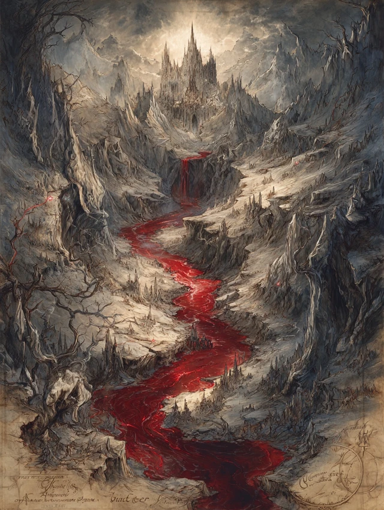

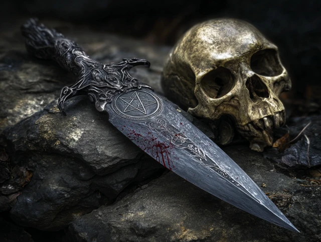

After Dumal departs, the party finds — pinned to a nearby post by the bone-handled shortsword from his hip — a folded parchment.

**It is a small, hand-drawn map.**

The map shows:
- A circle in the south labeled **"Olanthius — Shattered Cathedral. Alone. Easy."**
- A circle in the east labeled **"Bel — Forge. Hard. Watch your tongue."**
- A circle in the far north labeled **"Bleeding Citadel — manifests in 17 days. Be there or wait another month."**
- A small mark in the west labeled simply **"Her."** No further detail.

**Dumal has given them the map.** Free intel. *He wants them to choose.*

The bone-handled shortsword — left as a gift, or a challenge — is now the party's. **DM call: is it cursed, attuned to Bhaal, or just a knife?** Suggestion: **a Bhaal-marked dagger, +1, deals an extra 1d6 necrotic.**

| State | Bhaal tick | Effect |
|---|---|---|
| Carrying unattuned (in pack, not on belt) | **0** | Inert. No tick. |
| Carrying on person (belt, sheath) | **+1 per session** | Whisper-dreams flavor only. |
| Attuned (3 attunement slots — takes one) | **+5 immediate, +1 per session ongoing** | Gains the +1 / 1d6 necrotic bonus. Drenwal hears Dumal's voice during long rests. |
| Destroyed (smith's forge, holy ground, Coram shrine ideal) | **−10 Bhaal** | Permanent. Plot beat. |
| Cleansed via **Remove Curse** (lvl 3, SRD 2024 — https://open5e.com/spells/srd-2024_remove-curse) | **−3 Bhaal** | Becomes a mundane +1 dagger. The Bhaal-mark is severed from it. Drenwal must be the one to cast or witness. |

### Beat 5.3 — Tracker Update (announce visibly)

Update both meters based on Drenwal's choices this session. Sample math if he refused with time, didn't accept any contract, and refused the dagger:

- **Bhaal's Claim:** 50 → started at 50, +5 for Dumal making contact, +3 for the witness, +3 for the 5-day hunger, -3 for refusing Dumal's offer with narration, -3 if he asked the imp's name (small grace), -2 from Lulu = **53**.
- **Gargauth's Bargain:** 35 → +3 for Shield humming, +5 if he asked Gargauth a direct question, -3 if he refused Gargauth's whisper this session = **40 (or whatever the math gives you).**

**Announce the numbers.** Let the player see them. The visibility IS the system.

### Beat 5.4 — The Final Beat

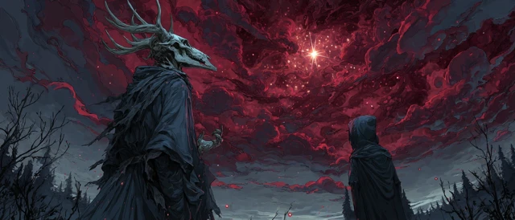

> The smog is thinning. Somewhere overhead, behind the gore-clouds, a *star* is visible. One. The first time in weeks.
>
> The Moonkite is looking at it. Aurora is looking at it. The Moonkite makes a low sound — not a call. A *welcome*.
>
> Drenwal looks at the map in his hand and the dagger at his feet and the letter folded in his pocket and the place inside himself where his Hunger lives.
>
> Asimov breaks the silence: *"...so. Who's Senna?"*
>
> **END SESSION.**

---

## DUMAL — STATBLOCK

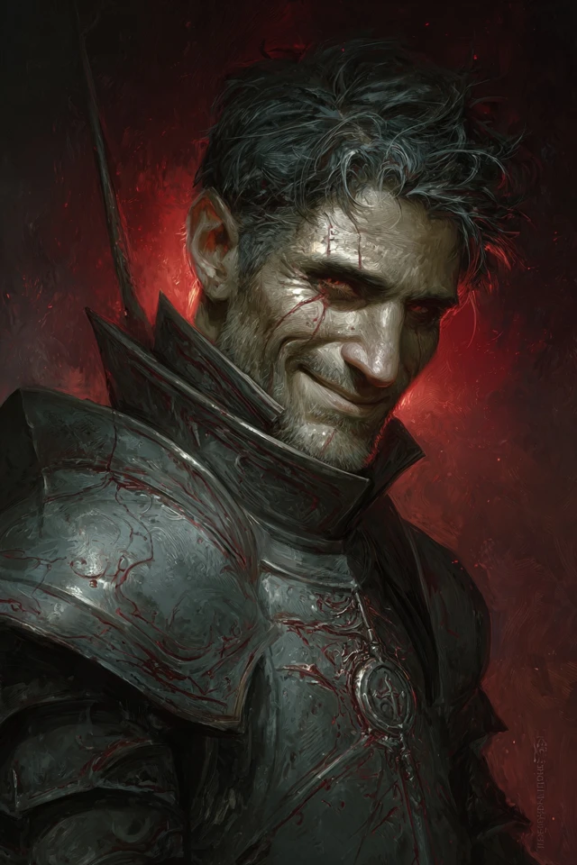

**Dumal of Elturel, the Flame Ascendant**
*Medium humanoid (Bhaalspawn), neutral evil*

- **Armor Class** 19 (Bhaal-corrupted plate, +1)
- **Hit Points** 220 (24d8 + 96)
- **Speed** 30 ft

| STR | DEX | CON | INT | WIS | CHA |
|---|---|---|---|---|---|
| 20 (+5) | 16 (+3) | 18 (+4) | 14 (+2) | 16 (+3) | 18 (+4) |

- **Saving Throws** STR +9, CON +8, WIS +7, CHA +8
- **Skills** Athletics +9, Insight +7, Intimidation +8, Perception +7, Religion +6
- **Damage Resistances** necrotic, fire; bludgeoning, piercing, slashing from nonmagical weapons
- **Damage Immunities** poison
- **Condition Immunities** charmed, exhaustion, frightened, poisoned
- **Senses** truesight 60 ft, passive Perception 17
- **Languages** Common, Infernal, Abyssal
- **Challenge** 13 (10,000 XP)
- **Legendary Resistance (2/day).** If Dumal fails a save, he can choose to succeed instead.

### Traits

- **Bhaal's Anchor.** Wish, Plane Shift, Banishment, and other reality-altering spells targeting Dumal fail unless they roll above a DC 20 caster-ability check. Bhaal holds his soul.
- **Bhaal Sight.** Dumal automatically detects any creature with the "Bhaalspawn" descriptor within 1 mile. He knows their current emotional state.
- **Hunger Pact.** Dumal does not need to eat, sleep, or breathe. When he kills a humanoid, he heals 20 HP.
- **Magic Resistance.** Advantage on saves against spells and magical effects.

### Actions

- **Multiattack.** Dumal makes three attacks: two with his Lance of Bhaal and one with his Ritual Dagger (or a Bhaal-Marked Strike instead of his second Lance attack once per turn).
- **Lance of Bhaal.** *Melee Weapon Attack:* +10 to hit, reach 10 ft, one target. *Hit:* 11 (1d12 + 5) piercing damage plus 9 (2d8) necrotic damage. If the target is reduced to 0 HP, Dumal regains 20 HP.
- **Ritual Dagger.** *Melee Weapon Attack:* +9 to hit, reach 5 ft, one target. *Hit:* 7 (1d6 + 4) piercing damage plus 4 (1d8) necrotic damage. If the target is a Humanoid and Dumal scores a critical hit, he carves a Bhaal symbol into them (permanent unless removed by Remove Curse or higher).
- **Bhaal-Marked Strike (Recharge 5–6).** Replaces one Lance attack. As Lance of Bhaal, but on a hit, the target must succeed on a DC 16 CON save or take an additional 27 (6d8) necrotic damage and gain the **Bhaal Mark** condition: disadvantage on all saves against Bhaal-aligned effects for 24 hours. Drenwal automatically fails this save (Bhaal blood resonance) — *play this for the horror, not the damage.*
- **Bhaal Smoke (1/day).** Dumal exhales a 20-ft cube of opaque, sentient red smoke. Creatures inside are heavily obscured to those outside. Dumal can move through the smoke without obstruction. The smoke lasts 2 rounds.

### Bonus Actions

- **Bhaal's Whisper.** Dumal speaks a single sentence to a target within 60 ft. The target makes a DC 16 WIS save or be **frightened** of Dumal for 1 round. **Drenwal automatically fails this save unless he has spent the prior round actively praying to a non-Bhaal deity.**

### Legendary Actions (3/turn)

- **Step (1 action).** Move up to half speed.
- **Bhaal's Hand (2 actions).** A spectral red hand emerges from the ground at a point within 30 ft and makes a melee attack: +9 to hit, 9 (2d8) necrotic damage and the target is grappled (escape DC 17).
- **Sibling Strike (3 actions, only against Drenwal).** Dumal makes one Lance attack against Drenwal with advantage. On hit, Drenwal must save DC 16 WIS or *hear Dumal's voice in his head* for 1 hour after combat ends — Dumal narrates Drenwal's actions to Drenwal, in real-time, mockingly. **Roleplay-only effect.** No mechanical penalty. But Bhaal +5 if it lands.

---

## SUPPORTING CAST IN ACT 3+ (if combat happens)

### Bhaal Cultists ×3 (Cult Fanatic — SRD 2024)

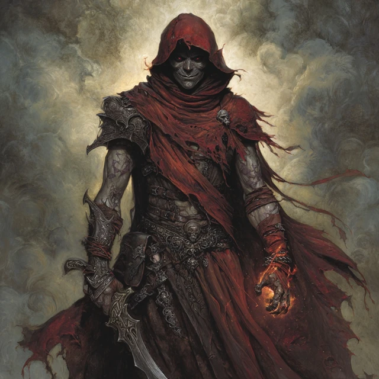

**Open5e:** https://open5e.com/monsters/cult-fanatic

- **AC 13, HP 22, CR 2** (corrected from prior 33 HP — RAW is 22)
- **Stats:** STR 11 / DEX 14 / CON 12 / INT 10 / WIS 13 / CHA 14
- **Multiattack:** 2 dagger attacks. **Dagger:** +4 to hit, reach 5 ft or 20/60 ft, 4 (1d4+2) piercing.
- **Spellcasting (4th-level cleric, spell save DC 11, +3 to hit):**
  - Cantrips: Light, Sacred Flame, Thaumaturgy
  - 1st (4 slots): Command, **Inflict Wounds** (2d10 necrotic touch), Shield of Faith
  - 2nd (3 slots): **Hold Person** (DC 11 WIS, paralyzed), **Spiritual Weapon** (1d8+2 force, BA)
- **Dark Devotion:** advantage vs charm/fright.
- **Tactic:** Two stay back and cast Spiritual Weapon + Hold Person. One charges Drenwal with the ritual dagger.
- **Dumal will kill these himself in Round 3** for theatrical effect if combat is going his way.

> **Live pull at table:** `mcp__open5e__get { resource_type: "monsters", slug: "cult-fanatic" }`

### Bone Devil (SRD 2024)

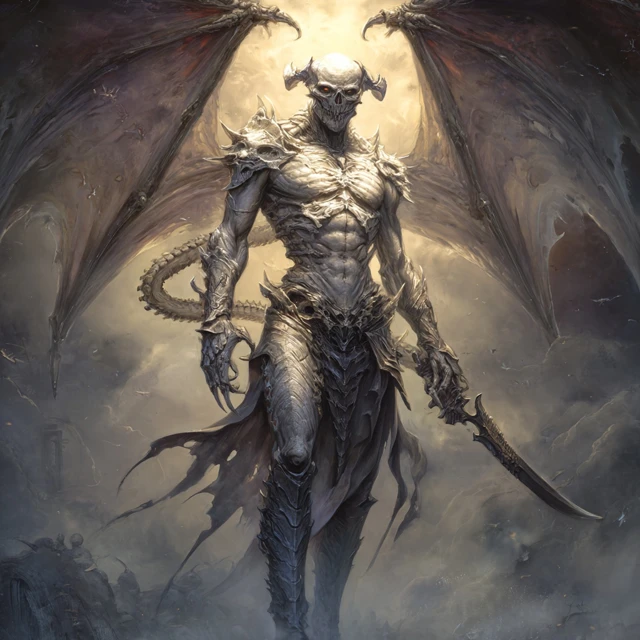

**Open5e:** https://open5e.com/monsters/bone-devil

- **AC 19, HP 142, CR 9, Speed 40 ft / fly 40 ft**
- **Stats:** STR 18 / DEX 16 / CON 18 / INT 13 / WIS 14 / CHA 16
- **Saves:** INT +5, WIS +6, CHA +7
- **Damage resistances:** cold; bludgeoning, piercing, slashing from non-silvered nonmagical
- **Damage immunities:** fire, poison. **Condition immunities:** poisoned.
- **Senses:** darkvision 120 ft, passive Perception 9. **Languages:** Infernal, telepathy 120 ft.
- **Multiattack:** 2 claws + 1 sting.
  - **Claw:** +8 to hit, reach 10 ft, 8 (1d8+4) slashing
  - **Sting:** +8 to hit, reach 10 ft, 13 (2d8+4) piercing + 17 (5d6) poison; **DC 14 CON save** or poisoned 1 min (repeats save end of each turn).
- **Devil's Sight + Magic Resistance.**
- **Tactic:** Flies above the dialogue scene during Act 3 (silent overhead). Bodyguards Dumal in combat. Targets the highest-damage party member. **It can fly — use the vertical axis.**

> **Live pull at table:** `mcp__open5e__get { resource_type: "monsters", slug: "bone-devil" }`

### Vix the Imp (SRD 2024 — https://open5e.com/monsters/imp)

- **AC 13, HP 10, CR 1, Speed 20 ft / fly 40 ft**
- **Sting:** +5 to hit, 1d4+3 piercing + DC 11 CON save or 3d6 poison
- **Invisibility (at will)** until it attacks. **Shapechanger:** rat / raven / spider forms.
- Polite. Won't attack unless cornered. **Has biscuits in his pouch** (irrelevant flavor).
- If killed: triggers Dumal's furious-arrival path. Don't kill the imp.

---

## ADDITIONAL LORE (for DM use — Dumal can reveal any of this if pressed)

### The Hellrider Cult of Bhaal

- Founded ~120 years ago, post-Descent of Elturel preparation
- 13 members at peak, dormant within the order
- Recognized each other by **scarred forearms with a single small cut on the right pinky tendon**
- Father (Drenwal's father) was killed by them
- The cult was destroyed during the Descent itself — Zariel's forces did not distinguish
- Dumal believes himself the **last** of this lineage outside Bhaal's direct service

### Mother — Vyssa Ardent

- Bhaalspawn, knew it from age 9
- Married a Hellrider to **die in service to the Light** — her plan was suicide-by-religious-life
- Had two children anyway (it surprised her — Bhaal "permitted" it for his own reasons)
- Slow-poisoned herself with elven nightroot for 4 years, starting when Drenwal was 6
- Died when Drenwal was 10. Drenwal believes it was wasting sickness.
- Buried in Elturel — her grave, now in Hell, may be findable

### Father — Ser Halvard of Elturel

- Senior Hellrider, decorated, devoted to the Morninglord
- Did **not** know about Mother's nature
- Killed in his sleep the night before the Descent by the cult, with the ritual shortsword Dumal now carries
- Dumal claims the killer was a man Halvard had broken bread with for thirty years
- Drenwal was 18 when this happened. Believed his father died in the Descent.

### Senna — the Sister

- Born to Mother in secret, smuggled out of Elturel by **a Harper named Issa** before Mother's death
- Currently 6 years old
- Living in a small farmhouse on **the southern Sword Coast**, raised by Issa as her own daughter
- Issa does NOT know what Senna is — she was paid to raise a "noble child in hiding"
- Dumal has known Senna's location for **two years** and has not approached her — he is waiting for Drenwal
- **If Drenwal asks: how do you know about her?** *"Bhaal told me. He likes to talk about family."*
- **Senna has not shown any signs of her nature yet.** She is six. It typically begins at nine.

### The Forgotten God — Coram of Small Mercies

- A pre-Sundering deity who survived as a folk-saint
- Domain: small mercies, given freely. Lost or stolen kindnesses.
- Last temple: a single roadside shrine outside the village of **Tarsweald** on the Western Heartlands
- Two priestesses left: **Old Mara** and her niece **Tessa**, both women in their seventies and twenties respectively
- Mordenkainen has visited them four times in the past year (per Dumal's intelligence)
- If Mordenkainen is brokering Drenwal's rebirth: Coram is the candidate

---

## SKILL CHECK QUICK REFERENCE

| Check | DC | Notes |
|---|---|---|
| Identify the mortal man's noble sigil | INT (History) 14 | House Ardentwine of Elturel |
| Read the cave painting / Bhaal carving meaning | WIS (Religion) 13 | Bhaal symbol + Dumal's signature |
| Insight on Dumal during dialogue | WIS (Insight) 18 (he is honest) | All revelations are TRUE — but he is shading WHY he's offering them |
| Recognize Dumal's handwriting | passive (Drenwal only) | auto-success |
| Track Senna's location via the map | WIS (Survival) 22 | impossible without more info — the mark is unlabeled |
| Identify the bone-handled shortsword | INT (Arcana) 16 | Bhaal-marked, +1, +1d6 necrotic, ticks Bhaal influence on attune |
| Detect Wish backlash on Aurora | WIS (Medicine) 14 | tells you about the STR debuff, not the spell-block |
| Hunger save (Drenwal) | WIS save 15 | held at +3 instead of +5 |
| Resist Dumal's Bhaal Whisper | WIS save 16 | Drenwal auto-fails unless praying overtly |

---

## XP & REWARDS

| Source | XP |
|---|---|
| Dumal departed without combat (peace path) | 5,000 (story award) |
| Dumal departed at low HP (combat path, no kill) | 7,500 |
| Dumal "killed" (Bhaal extraction) | 10,000 |
| Bone Devil killed | 5,000 |
| Cult Fanatics killed (3) | 450 each = 1,350 |
| **Major lore beat: family revelations accepted** | 2,000 (milestone) |
| **Drenwal makes overt act of faith to non-Bhaal/Gargauth god** | 1,500 |
| **Letter read and processed** | 500 |

**Treasure:**
- Dumal's map (free intel — Olanthius location, Bel location, Bleeding Citadel timing, Senna existence)
- The bone-handled shortsword (Bhaal-marked dagger, +1, +1d6 necrotic; **cursed in the sense that attunement = +5 Bhaal immediately**)
- (If Aldwin Ardentwine's body taken for return to Elturel) Sword of House Ardentwine — heirloom, future plot hook

---

## SOUNDTRACK CUES

- **Cold open (Palace aftermath):** Tabletop Audio — "Sundered Hall" / Adrian von Ziegler — "Mourning"
- **Aurora's mount moment:** Peter Gundry — "Celestial Flight" / Two Steps From Hell — "Star Sky" (low)
- **Lulu's lucid moment:** Peter Gundry — "Whispers of the Past"
- **Vix the herald:** Michael Ghelfi — "Devilish Negotiations" (light, theatrical)
- **Dumal's approach:** Two Steps From Hell — "Protectors of the Earth" / Audiomachine — "The Witness"
- **Dumal's dialogue (long scene):** Adrian von Ziegler — "Fall of the Druid" (slow, melancholy, no percussion) → low loop
- **Family reveals:** drop music entirely for 30 seconds when Mother is revealed. Silence is the score.
- **Sister reveal:** Peter Gundry — "Music for a Dying Star"
- **Combat (if triggered):** Two Steps From Hell — "Heart of Courage" / "Blackheart"
- **Dumal departs:** Hidden Citizens — "Fall in Line" (instrumental) / Audiomachine — "Reverie"
- **Final beat (the star, the map):** Adrian von Ziegler — "Spirit of the Forest"

---

## DM PREP CHECKLIST

- [ ] Print **Aldwin Ardentwine's letter** as a physical handout
- [ ] Print **Dumal's map** — small piece of parchment, hand-drawn in pencil
- [ ] Prepare **two Bhaal/Gargauth tracker visuals** (whiteboard, paper, etc.) — player must see them
- [ ] Decide which noble house the dead Hellrider belongs to (default: Ardentwine)
- [ ] Decide if the bone dagger is a real item kept (cursed mechanic above) or a one-session prop
- [ ] Pre-roll Aurora's d4 for spell-loss duration
- [ ] Pre-decide your Coram-of-Small-Mercies village (Tarsweald default — match to your campaign map)
- [ ] **Practice Dumal's voice** — he must be charming, articulate, and unmistakably the brother. Not a cackling villain. Think charismatic cult-leader who actually loves his brother.
- [ ] Pre-roll Hunger save for Drenwal so you can drop the result mid-scene without breaking flow
- [ ] Have a soft music loop ready for the dialogue scene (Act 3 is 75 minutes of talking — music must not fight you)

---

## CONSEQUENCES / SEEDS FOR NEXT SESSION

| Choice this session | Seed for Session 6+ |
|---|---|
| Drenwal accepted Dumal's offer | Solo arc for one session, then Drenwal returns *changed* — or doesn't return |
| Drenwal refused with time | Olanthius next session, with a Bhaal-aligned encounter en route (Dumal sending mid-tier minions) |
| Drenwal attacked Dumal | Open war with Bhaal. Increased random encounters. Dumal returns with reinforcements at the Bleeding Citadel. |
| Letter read | Hook to return Aldwin's body to House Ardentwine in Elturel post-campaign |
| Senna mentioned by Dumal | Aurora or Asimov may want to find her before Dumal does — side quest opens |
| Mordenkainen accusation processed | Drenwal may seek to confront Mordenkainen — opens a "second tower" detour |
| Tarsweald named | Coram-of-Small-Mercies pilgrimage option — a route to the "third deity" cure |
| Bone dagger taken | Slow corruption arc OR purification quest (destroy at a Coram shrine?) |
| Smiler banishment owed | Smiler will come collecting. **Aurora has no Wish.** Banishment options (SRD 2024 verified): **(a) Banishment scroll (4th lvl, CHA save DC by caster, holds 1 min concentration — fiend then transported to home plane).** **(b) Plane Shift scroll (7th lvl, touch, 250+ gp forked rod attuned to Smiler's home plane; unwilling fiend gets CHA save).** **(c) Hire an NPC archmage** (Mahadi's Wandering Emporium has brokers — 500-2000 gp). **(d) Planar gate ritual (3-day prep, requires Bhaal-incompatible holy site — Coram's shrine at Tarsweald works).** Plant one of these as a future quest hook. Cleanest path = a Banishment scroll Drenwal can cast (he's a Cleric, it's on his list). |

---

## DUMAL — THE FULL ARC (Sessions 5–8+)

A four-encounter escalation. Dumal is the *slow-burn* antagonist of the rest of the campaign — every meeting raises the stakes, reveals more, and tightens the noose on Drenwal's cure window.

### Act I — "The Visit" (Session 5, this primer)

**Where:** Just outside the Palace of Gore, in the thinning gore-smog.
**What:** Family lore dump. The Offer. The Map. The Letter. The Dagger.
**Stakes:** Personal. Lore reveal #1 — Mother, Father, Senna, Mordenkainen.
**Dumal's emotional posture:** Charming, brotherly, sad. He misses Drenwal.
**Outcome lock:** Dumal departs alive. Drenwal has not yet decided.

---

### Act II — "The Tax" (Session 6 or 7 — between Olanthius and Bel)

**Where:** A devil-controlled toll bridge, or a caravan caravan halt, or while the party rests at a roadside chapel.
**What:** Dumal sends **a delegation** — not Dumal himself. Three Bhaal cultists (one a *zealot* with Hold Person and self-mutilation tricks) and a single **Ascendant Bhaalspawn aspirant** (CR 6, weaker Dumal-clone). They are not attacking the party. They are collecting **the tax of witness** — Bhaal demands that Drenwal *watch* them ritual-murder one captive. They have a captive — a Hellrider corpse, or a captured devil, or someone the party met briefly in a prior session.

**Drenwal's choice:**
- **Allow it:** Bhaal +12. Permanent dream-link with Dumal (he will speak in dreams from now on).
- **Refuse and fight:** Combat. Brutal. The aspirant has a **Hunger Field** that makes everyone in 20ft DC 14 WIS save or be compelled to attack a wounded ally. Aurora and Asimov get to be a real party here — Drenwal is the *target* of pressure.
- **Refuse without fighting:** Bhaal -5. The cultists withdraw, openly mocking. They will return.

**Lore reveal #2:** The aspirant carries a **letter from Senna**. Hand-drawn in crayon. *"Dear Brother Drenwal — Uncle Dumal says you are a hero. He says you are coming to see me soon. I am six. I have a cat named Cricket. Please come. — Senna."*

The letter is REAL. Senna wrote it. Dumal had it delivered.

**Twist:** The "Bhaal aspirant" is a former friend of Drenwal's from the Hellriders — name him. Drenwal recognizes him in combat. *"...Geir? Geir, you cannot — gods, what did they do to you?"* The aspirant cannot speak. His mouth is sewn shut.

---

### Act III — "The Sister at the Door" (Session 8, near the Bleeding Citadel)

**Where:** A roadside, or inside the Bleeding Citadel approach.
**What:** Dumal arrives in person. **He has Senna with him.** A six-year-old girl, holding his hand, scared but not crying. She has been told that her brothers are coming to live with her in a beautiful house.

> "Den. I lied last time. I said I would not bring her. I lied because you were not ready. *Look at her, Den. Look at her face.* This is what we are protecting. This is who you are going to walk past, if you stay with these people."
>
> *Senna waves shyly. She does not understand any of this. She thinks Drenwal is a knight in a story.*

**The choice:**
- **Take Senna from Dumal:** Combat OR a high-stakes social roll (DC 22 CHA against Dumal's resistance). If successful, Senna is *yours* — and Bhaal turns his full attention on the party. Permanent random Bhaal encounter chance, x3.
- **Walk away from Senna:** Bhaal +30. Drenwal will dream of her face every night. Mechanically: -1 to all WIS saves until resolved.
- **Strike a temporary deal:** Senna stays with Issa (her current foster mother). Dumal agrees to a 1-year truce *if* Drenwal accomplishes one task for him. Specify task: kill Olanthius, or destroy the Forgotten God's shrine, or sign a small contract.

**Lore reveal #3:** Senna is **already showing signs**. She has a small habit Dumal won't explain in front of her — she likes to *bite her thumb until it bleeds* when she's thinking. *"It is small. It is starting. Imagine her at nine. Imagine her at fifteen, alone with the Harpers who do not know what she is."*

**Twist:** Issa the Harper is *present*. Hidden nearby, with a small contingent of Harpers. She has finally figured out what Senna is. She is here to *take Senna back from Dumal*. **A three-way standoff.**

---

### Act IV — "The Choice at the Crossing" (Session 9+, climactic)

**Where:** At the moment of Drenwal's cure ritual — wherever the third deity is brokered. Most likely Tarsweald, at Coram's roadside shrine, at the moment Drenwal is meant to "die and be reborn."

**What:** Dumal arrives at the *exact moment of the rebirth window*. Two ways:
- **He participates in the ritual** — offers to be one of the four witnesses required for the deity's claim. If the party accepts, Bhaal gains a foothold inside the ritual. If they refuse, he attacks.
- **He attacks to stop the ritual** — Bhaal has commanded him to. Brother vs brother, on the holy ground of a forgotten god. Senna is somewhere safe (or watching). Mordenkainen may appear here too.

**The fight (if it happens):** This is the duel session. Dumal is at FULL power. Lair actions if it's at Coram's shrine. Bhaal can intervene legendarily — narrative god-roll once per round.

**Possible outcomes:**
- Drenwal dies in the rebirth — Coram catches him. Drenwal returns *human*. Bhaal claim broken. Dumal flees back to Bhaal, marked as a failure. Sequel hook: Bhaal personally hunts the party.
- Drenwal dies in the rebirth — Bhaal catches him. Drenwal returns *Bhaalspawn ascendant* like Dumal. Becomes an NPC. New PC needed. Heavy session.
- Drenwal kills Dumal mid-ritual — Coram refuses the broken soul. Drenwal becomes a hybrid — neither Bhaal nor Coram fully holds him. He is *free* in the dangerous sense.
- Drenwal SAVES Dumal mid-ritual — Coram catches BOTH brothers. Two reborn humans. Bhaal furious. This is the *redemption ending*.
- The party fails — Bhaal claims Drenwal. Campaign pivot to "save Drenwal from his god" arc.

**Senna's fate:** Whichever outcome — Senna is rescued / raised / hidden / lost depending on prior choices.

---

### Tracker Goals Across the Arc

- **Session 5 end:** Both meters ~50-55. Trackers visible. Player invested.
- **Session 6-7 end:** Spread. If party plays well, Bhaal stays 50-60 while Gargauth and the third deity (Coram if seeded) climb. If party plays poorly, Bhaal 70+.
- **Session 8 end:** Decision crystallized. Player should know which deity they want to catch Drenwal.
- **Session 9+ ritual:** The math IS the climax. The highest meter wins. The third deity is the *upset victory* option.

---

## AVERNUS RANDOM ENCOUNTER TABLE — for Session 5+ Travel

Roll **d20** every 4 hours of travel. Reroll if duplicate within same session. **Encounters marked ★ are deeply Avernus-flavored** — use these to remind players they are in *Hell*, not a fantasy wilderness.

| d20 | Encounter | Hook / Notes |
|---|---|---|
| 1 | ★ **Soul Wagon convoy** (3 cages on wheels, pulled by burnt-out lemure-things) | A devil tax collector with manifest in hand. Souls inside are mostly silent; one calls out to the party by name (a person they failed to save in a prior session). RP heavy. Combat optional (CR 5 devil teamster). |
| 2 | ★ **A flesh-architect at work** | A bone devil-class fiend is *reassembling* fallen Avernus soldiers from parts, building a unit. It will pay good gold (3 soul coins) for fresh body parts. Drenwal can choose to destroy its work (Bhaal +5 from cruelty? or -3 from mercy? DM judgment). |
| 3 | ★ **Lemure puddle** (the road dissolves into a 60ft pool of slowly-congealing pale flesh) | DEX save DC 13 or sink. Inside the puddle: 12 lemure-things slowly forming. CR 2 each. If killed before fully forming: -1 lemure per kill, but the puddle re-congeals in 1 hour. |
| 4 | ★ **The Imp Tax Collector** | A polite imp on a small cart asks for "the toll." The toll is one negative emotion, given freely. He has a small jar. If the party pays: Bhaal -2, Gargauth +2 (it's a contract). If they refuse: he hands them a tiny IOU note that complicates a *future* social roll. |
| 5 | ★ **Pact-broker on a stump** | An older man in a velvet coat sits on a tree stump in the middle of nowhere with a small writing desk. He is not a devil. He is *worse* — a mortal who chose this work. He offers each party member one wish, in exchange for "anything you can spare." Lean into Faustian bargain horror. Aurora will *want* this. |
| 6 | **Erinyes patrol (1 + 2 chain devils)** | A Zariel patrol, hunting unaligned souls. They will let the party pass if shown a Zariel-aligned token (do they have one?). If not, CR 12+ combat. |
| 7 | ★ **The Ghost of a Hellrider** | A spectral knight on a spectral horse rides up. He died at the Wall, in the Descent. He asks: *"Has the city been freed yet?"* What the party answers will haunt them. He weeps if told the truth. Drenwal can recognize him (passive). Possible **Coram +5 devotional** if Drenwal kneels and prays for him. |
| 8 | ★ **Two pit fiends dueling in the distance** | Visible across a valley. The party watches a Blood War-tier fight from 1 mile away. NO combat. Pure environmental storytelling. If they get closer, they die. Add: a survivor from the loser's host begs them for an honorable death (CR 7 chain devil, dying, lawful — odd request). |
| 9 | ★ **Memory Rust** (a patch of red lichen growing across a hill) | Anyone crossing it must save WIS DC 14 or **forget one personal memory** (player picks what to lose, ideally a memory tied to a low-tracker deity). Lulu will warn them. Some Bhaalspawn dreams are *stored* here. Dumal has been here. Drenwal can find traces if he searches. |
| 10 | **Hellwasp swarm** (3 swarms of CR 1/2 wasps with poison) | Simple combat. Drains resources. |
| 11 | ★ **Bhaal-marked altar at a ruin** | A pre-Descent ruin with a small stone altar carved with the Bhaal symbol. Recent blood on it. If Drenwal touches it: Bhaal +5 AND a vision of Dumal's last kill. If destroyed (1d8 thunder, AC 14, HP 30): Bhaal -5, Coram +3 (mercy via destruction). |
| 12 | ★ **The Auction** | A bone devil with a podium auctioning a captive **lillend** (CR 7, celestial-aligned, exhausted and chained). Starting bid: 5 soul coins. Bidders: 4 devils, 1 nervous mortal cultist. If the party intervenes: combat OR a bid war. If they save the lillend: +5 Coram devotional. The lillend knows the song of Coram. *This is a major Coram seed.* |
| 13 | ★ **Mortzengersturm Detour** | They stumble onto the territory of Mortzengersturm (the Mad Magician), the demipliskin from the official module — a deranged owlbear-collector. Use the official rules if relevant. Short detour, harmless if they leave. Could net them an exotic mount (a flying owlbear?). |
| 14 | ★ **Smiler's lieutenant arrives** | A henchman of Smiler the Defiler rides up on a Devil's Ride. *"Boss wanted to remind you: his banishment is owed. Are you working on it?"* Pure pressure check. If they say "yes, soon": no consequence. If "no" or "we forgot": Smiler ambushes them within 2 sessions. |
| 15 | ★ **The Sane Madman** | A mortal man, naked, painted in soot, sitting in a salt circle in a charred field. *"You are the one with the Wish. I have been waiting for you. Bhaal sent for me, but I refused. He cannot take me while I am in this circle. Sit. Listen."* He knows **one true secret** per session — DM picks what to feed them. He is harmless inside the circle. Outside it, he ages to dust in 30 seconds. **Major lore-drop NPC. Use sparingly.** |
| 16 | ★ **Hag's offer** (Night hag, alone, weaving) | She offers each PC a *dream-bargain* — for a small price (1 memory, 1 year, 1 secret), she will give them a TRUE dream of a person they love. Aurora will be tempted (the Moonkite's lost patron?). Drenwal could see Senna. Asimov could see... Rasheem's real face. **Trap and treasure both.** |
| 17 | **Roving devil patrol** (3 bearded devils, 1 barbed devil) | Standard combat. Drop a Bhaal-marked weapon on the bearded devil leader — Drenwal can identify it as cult-craft. |
| 18 | ★ **A Bleeding Tree** | A massive, twisted tree on the roadside. Its bark is a single open wound. Anyone who touches it must save CON DC 12 or take 2d6 necrotic and gain *one memory* of a Hellrider who died at this spot. **Drenwal may receive a memory of his father.** Once-per-campaign event — only fire this near a Drenwal-relevant moment. |
| 19 | ★ **Lost celestial** | A wounded **deva** (CR 10, friendly) is hiding in a ravine. She has been hunted by Zariel's forces for a week. If aided: she gives Aurora a feather of her wing (one-shot use — cast Sanctuary on self once). +10 Coram devotional if Drenwal is the one who helps her. She knows **about the Bleeding Citadel manifestation tide** and confirms what Dumal said (17 days). |
| 20 | ★ **Mordenkainen's Messenger** | A small **pseudodragon** in a tiny vest delivers a sealed note. The note is from Mordenkainen: *"Be at Tarsweald in 15 days. Bring nothing of Bhaal's making. — M."* (This is the Coram cure pitch arriving.) The pseudodragon will return with a reply if they write one. **Always set this aside for a moment when the party most needs a thread.** |

### Encounter Pacing Rule of Thumb

- **First long-rest stretch (Sessions 5-6):** Roll twice per day-of-travel. Throw at least one ★ encounter.
- **Sessions 7-8:** Roll once. Save ★ slots for Dumal-relevant beats.
- **Climactic session (Act IV):** No random encounters. Everything is intentional.

---

## MID-SESSION REQUEST PROTOCOL — How to Use Me at the Table

When the table is live and you need *fast* help, paste prompts in this format:

**For statblocks on the fly:**
> `quick statblock: <creature name> for level 11 party, CR ~<n>, theme <bhaal/celestial/elemental>`

I'll deliver: AC, HP, attacks, 1-2 traits, 1-2 actions, in under 30 seconds of reading.

**For NPC dialogue:**
> `dumal line: he's just been told <X>. give me 2 in-character responses, one cold and one warm.`

I'll deliver 2-3 lines of dialogue ready to read.

**For lore drops:**
> `bhaal lore: how would dumal know that <X>?`

I'll deliver a plausible in-fiction reason in 2-3 sentences.

**For Avernus environment:**
> `what does <location> look like in avernus? party is approaching, 1 paragraph read-aloud.`

I'll deliver a sensory read-aloud, no mechanics.

**For ruling:**
> `ruling: aurora wants to <X>. is it possible, and what's the cost?`

I'll give yes/no/conditional with a fair cost.

**For Bhaal/Gargauth tracker math:**
> `tracker: drenwal just <X>. how much does it shift?`

I'll give exact numbers from the v2 system above.

**For everything Avernus has to offer — I will have ready:**

- All canonical Avernus locations (Bleeding Citadel, Bel's Forge, Wandering Emperor's wagon, Mahadi's Wandering Emporium, the River Styx, Stygian Dock, Lake of Boiling Mud, Bone Brambles)
- All canonical Avernus NPCs (Bel, Olanthius, Tiamat's herald, Mahadi, Mad Maggie, Lulu's full backstory, Zariel's court, the Hellriders' lore)
- Devil hierarchy (lemure → imp → spined → bearded → barbed → chain → bone → ice → horned → erinyes → pit fiend → archdevil)
- Bhaal-canon (his murders, his church, the Dead Three, his sons through history, the Bhaalspawn Saga from Baldur's Gate 1/2/3)
- Gargauth canon (the Tenth Pit Fiend, Hidden Lord, the Shield)
- Coram-of-Small-Mercies (which I invented this session — note the lore I established: pre-Sundering deity, Tarsweald shrine, Old Mara + Tessa, Mordenkainen visited 4× this year)
- The Fallen Three full backstories and current locations

**To brief me on a new development:** just type what happened. I'll absorb it and adjust on the fly. Don't worry about format — just dump it raw.

### Open5e MCP — pre-canned at-table queries

I will use these automatically when you ask the matching question. You can also paste them verbatim.

| You say | I run |
|---|---|
| `open5e: <monster name>` | `mcp__open5e__get { resource_type: "monsters", slug: "<kebab-case>" }` — returns full statblock |
| `open5e spell: <name>` | `mcp__open5e__get { resource_type: "spells", slug: "srd-2024_<name>" }` — returns RAW text |
| `find CR <n> <type>` | `mcp__open5e__list { resource_type: "monsters", cr: n, type: "<Fiend\|Celestial\|...>" }` |
| `rules: <question>` | `mcp__open5e__rag_search { query: "<question>", mode: "hybrid" }` — hybrid lexical + semantic |
| `is <slug> a thing?` | `mcp__open5e__check_slug { resource_type, slug }` — collision check |

**Caching:** First call to Open5e per session is ~350ms. Subsequent identical calls are cached. Batch up to 50 resources via `mcp__open5e__batch_get` when prepping a full encounter.

---

## QUICK-OPEN INDEX (for at-table reference)

- **Cold open:** see top of "COLD OPEN"
- **Letter handout:** Act 1, Beat 1.1 / "THE LETTER"
- **Carving discovery:** Act 1, Beat 1.3
- **Vix the imp:** Act 2, Beat 2.3
- **Dumal arrival read-aloud:** Act 3, Beat 3.1
- **Family reveal sequence:** Act 3, Beat 3.2 (Mother → Father → Sister → Mordenkainen → Offer)
- **Dumal statblock:** "DUMAL — STATBLOCK"
- **Trackers:** every act has tracker updates flagged

## DM-ONLY APPENDIX — Future-Session Foreshadow

**DO NOT show this image to the players in Session 5.** It belongs to Session 6 or 7, when Dumal hands over the crayon letter from Senna. The visual surprise IS the punch.

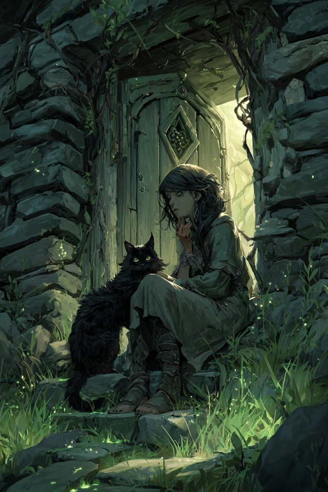

The art-style break (warm green-gold instead of red/grey) is the visual cue when you finally drop it on the table — *this is what the brothers are fighting over*.

---

Good luck. Watch their faces when he says Senna's name.
